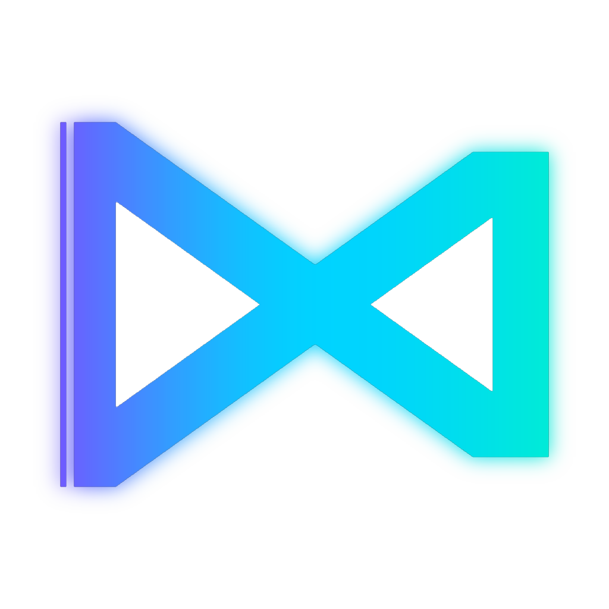

# Next
The compiler of a multi-paradigm programming language combining the power of C++ and the simplicity of Python

### Install
#### Windows
Go to [Official site](https://nextlang.com/download) and click __Download__. Next, wait for downloading and launch ___setup.exe___.

#### Linux
Open terminal and write\
`sudo apt install next-compiler`

#### Build from source
Open terminal and write
```
git clone https://github.com/NikitaNakahara/Next
cd Next
mkdir build
cd build
cmake ../src
make
```

### Hello, world
```next
import io;

func main(args: array<string>): int {
    println("Hello, world");
    
    return 0;
}
```

### Documentation
[Here](https://nextlang.com/docs) you can find more info about Next language